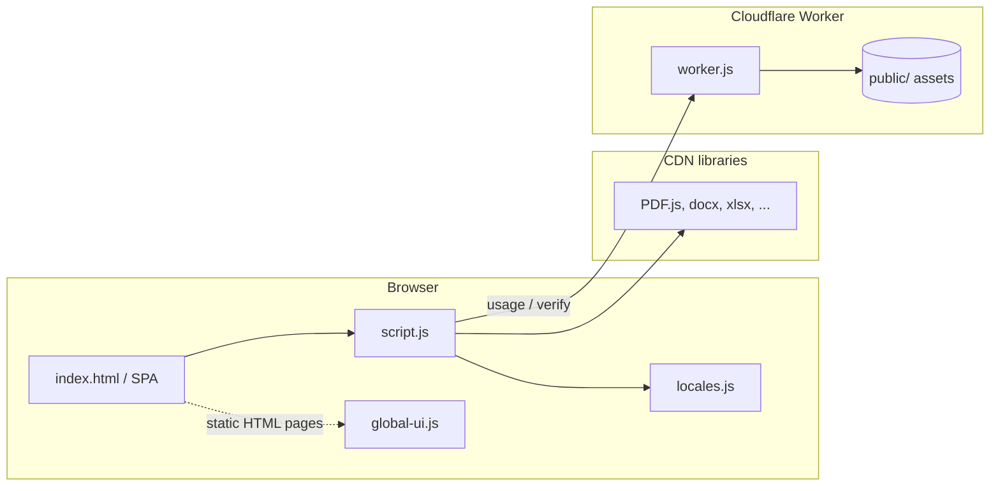

# Files Converter

**Live site:** [https://filesconverter.org/](https://filesconverter.org/)

Free, browser-based file conversion: PDFs, Office documents, images, audio, video, eBooks, archives, and data formats. The UI runs as a static single-page app on the homepage; optional Cloudflare Worker APIs handle usage limits and Paddle payment verification.

---

## Table of contents

1. [High-level architecture](#high-level-architecture)
2. [Repository map (functionality → files)](#repository-map-functionality--files)
3. [Routing and URLs](#routing-and-urls)
4. [Converters: ID, name, routes, and categories](#converters-id-name-routes-and-categories)
5. [Static and SEO pages](#static-and-seo-pages)
6. [Internationalization and theme](#internationalization-and-theme)
7. [Premium, usage limits, and cookies](#premium-usage-limits-and-cookies)
8. [Edge worker APIs](#edge-worker-apis)
9. [Service worker and offline](#service-worker-and-offline)
10. [Local development and deployment](#local-development-and-deployment)
11. [Build and minification](#build-and-minification)

---

## High-level architecture



- **Conversion logic** runs entirely in the browser (`public/script.js` + lazy-loaded CDN libraries defined in `LIBS`).
- **HTML/CSS** for the main app: `public/index.html`, `public/styles.css` (and minified variants where used).
- **Cloudflare Worker** (`worker.js`) serves `public/` as assets, applies security/cache headers, canonical redirects, and JSON APIs for usage and Paddle verification.

---

## Repository map (functionality → files)

| Area | Role | Primary files |
|------|------|----------------|
| Main converter SPA | Tool registry, routing, UI, conversions, Paddle client flow | `public/script.js`, `public/script.min.js` |
| Strings / i18n dictionaries | Locale text used by the SPA | `public/locales.js` |
| Static site shell | Header, footer, language switcher, localized copy on HTML pages | `public/global-ui.js`, `public/page-shell.js` (main static pages load both; many `tools/*.html` pages load `global-ui.js` only) |
| Styling | Layout, themes, components | `public/styles.css`, `public/styles.min.css` |
| Homepage / app entry | Document structure, theme bootstrap, script tags | `public/index.html`, `public/index.min.html` |
| PWA / caching | Precache, runtime cache, offline fallback | `public/sw.js`, `public/offline.html` |
| Edge runtime | HTTP routing, APIs, redirects, cookies, CSP | `worker.js`, `wrangler.toml` |
| SEO | Sitemap | `public/sitemap.xml` |
| SEO automation | Helpers for passes / articles | `scripts/seo-pass.js`, `scripts/generate-articles.js` |
| Tool landing pages | Per-tool static HTML (often mirror slug; link into app) | `public/tools/*.html` |
| Blog / articles | Editorial SEO pages | `public/blog*.html` |
| Root shim | May proxy or duplicate entry for local hosting | `index.html` (repo root) |

---

## Routing and URLs

| URL pattern | Behavior |
|-------------|----------|
| `/` | Main SPA: converter grid, filters, premium UI, language selector |
| `/tool/{toolId}` | **Inside the SPA** (no full page reload): `history.pushState` + `getToolFromPath()` in `public/script.js` opens that converter. A **cold browser navigation** to the same path on production hits the Worker redirect below. |
| `#/tool/{toolId}` | Legacy hash URL; normalized on load to `/tool/{toolId}` (`normalizeLegacyHashRoute`) |
| `/tools/{slug}.html` | Static SEO / info page with shared header/footer via `global-ui.js` |
| Direct `GET /tool/{slug}` (full page load) | On the Cloudflare Worker, **301 redirect** to `/tools/{slug}.html` (`getCanonicalRedirect` in `worker.js`) — canonical URLs for crawlers and shared links |
| `/about`, `/contact`, … | Clean paths redirected to `*.html` equivalents (`REDIRECTS` in `worker.js`) |

**Path aliases** (URL slug → internal `tools[].id`) in `getToolFromPath()`:

| Request slug | Resolved tool `id` |
|--------------|---------------------|
| `pdf-compress` | `compress-pdf` |
| `pdf-to-powerpoint` | `pdf-to-ppt` |
| `powerpoint-to-pdf` | `ppt-to-pdf` |

**Note:** `public/tools/` contains additional HTML files used for SEO and navigation. The **authoritative list of live in-app converters** is the `tools` array in `public/script.js`. Some tool HTML filenames may exist for marketing or future work without a matching `tools[]` entry yet.

---

## Converters: ID, name, routes, and categories

Categories come from `TOOL_META` in `public/script.js` (`organize`, `convert`, `images`, `workflow`, `ebooks`).

For any row below:

- **SPA route:** `https://filesconverter.org/tool/{Tool ID}`
- **Typical static page:** `https://filesconverter.org/tools/{Tool ID}.html` (use aliases above where applicable, e.g. `pdf-compress.html` → compress PDF)

| Tool ID | Display name | Category |
|---------|----------------|----------|
| `merge-pdf` | Merge PDF | organize |
| `split-pdf` | Split PDF | organize |
| `compress-pdf` | Compress PDF | organize |
| `pdf-to-word` | PDF to Word | convert |
| `pdf-to-ppt` | PDF to PowerPoint | convert |
| `pdf-to-excel` | PDF to Excel | convert |
| `pdf-to-jpg` | PDF to JPG | images |
| `word-to-pdf` | Word to PDF | convert |
| `ppt-to-pdf` | PowerPoint to PDF | convert |
| `excel-to-pdf` | Excel to PDF | convert |
| `jpg-to-pdf` | JPG to PDF | images |
| `html-to-pdf` | HTML to PDF | workflow |
| `pdfa-converter` | PDF to PDF/A | organize |
| `ocr-pdf` | OCR PDF | workflow |
| `pdf-to-epub` | PDF to EPUB | ebooks |
| `epub-to-pdf` | EPUB to PDF | ebooks |
| `pdf-to-mobi` | PDF to MOBI | ebooks |
| `mobi-to-pdf` | MOBI to PDF | ebooks |
| `pdf-to-md` | PDF to Markdown | workflow |
| `md-to-pdf` | Markdown to PDF | workflow |
| `pdf-to-latex` | PDF to LaTeX | workflow |
| `latex-to-pdf` | LaTeX to PDF | workflow |
| `pdf-to-jsonxml` | PDF to JSON/XML | workflow |
| `json-to-pdf` | JSON to PDF | workflow |
| `xml-to-pdf` | XML to PDF | workflow |
| `docx-to-odt` | DOCX to ODT | workflow |
| `odt-to-docx` | ODT to DOCX | workflow |
| `rtf-to-docx` | RTF to DOCX | workflow |
| `docx-to-rtf` | DOCX to RTF | workflow |
| `png-to-jpg` | PNG to JPG | images |
| `jpg-to-png` | JPG to PNG | images |
| `webp-to-jpgpng` | WebP to JPG/PNG | images |
| `heic-to-jpg` | HEIC to JPG | images |
| `svg-to-raster` | SVG to PNG/JPG | images |
| `tiff-to-raster` | TIFF to JPG/PNG | images |
| `gif-to-mp4` | GIF to MP4 | images |
| `pdf-to-text` | PDF to Text | workflow |
| `pdf-to-html` | PDF to HTML | workflow |
| `word-to-html` | Word to HTML | workflow |
| `word-to-txt` | Word to TXT | workflow |
| `excel-to-csv` | Excel to CSV | workflow |
| `excel-to-json` | Excel to JSON | workflow |
| `powerpoint-to-video` | PowerPoint to Video | workflow |
| `txt-to-pdf` | TXT to PDF | workflow |
| `rtf-to-pdf` | RTF to PDF | workflow |
| `webp-to-jpg` | WEBP to JPG | images |
| `webp-to-png` | WEBP to PNG | images |
| `bmp-to-jpg` | BMP to JPG | images |
| `tiff-to-jpg` | TIFF to JPG | images |
| `svg-to-png` | SVG to PNG | images |
| `svg-to-jpg` | SVG to JPG | images |
| `raw-to-jpg` | RAW to JPG | images |
| `ico-to-png` | ICO to PNG | images |
| `mp3-to-wav` | MP3 to WAV | workflow |
| `wav-to-mp3` | WAV to MP3 | workflow |
| `mp3-to-aac` | MP3 to AAC | workflow |
| `aac-to-mp3` | AAC to MP3 | workflow |
| `flac-to-mp3` | FLAC to MP3 | workflow |
| `wma-to-mp3` | WMA to MP3 | workflow |
| `ogg-to-mp3` | OGG to MP3 | workflow |
| `m4a-to-mp3` | M4A to MP3 | workflow |
| `mp3-to-ogg` | MP3 to OGG | workflow |
| `amr-to-mp3` | AMR to MP3 | workflow |
| `mp4-to-avi` | MP4 to AVI | workflow |
| `avi-to-mp4` | AVI to MP4 | workflow |
| `mkv-to-mp4` | MKV to MP4 | workflow |
| `mov-to-mp4` | MOV to MP4 | workflow |
| `mp4-to-mov` | MP4 to MOV | workflow |
| `wmv-to-mp4` | WMV to MP4 | workflow |
| `flv-to-mp4` | FLV to MP4 | workflow |
| `webm-to-mp4` | WEBM to MP4 | workflow |
| `mp4-to-gif` | MP4 to GIF | images |
| `mobi-to-epub` | MOBI to EPUB | ebooks |
| `epub-to-mobi` | EPUB to MOBI | ebooks |
| `azw-to-epub` | AZW to EPUB | ebooks |
| `fb2-to-epub` | FB2 to EPUB | ebooks |
| `zip-to-rar` | ZIP to RAR | workflow |
| `rar-to-zip` | RAR to ZIP | workflow |
| `zip-to-7z` | ZIP to 7Z | workflow |
| `7z-to-zip` | 7Z to ZIP | workflow |
| `tar-to-zip` | TAR to ZIP | workflow |
| `gz-to-zip` | GZ to ZIP | workflow |
| `json-to-xml` | JSON to XML | workflow |
| `xml-to-json` | XML to JSON | workflow |
| `csv-to-json` | CSV to JSON | workflow |
| `json-to-csv` | JSON to CSV | workflow |
| `csv-to-excel` | CSV to Excel | workflow |
| `sql-to-csv` | SQL to CSV | workflow |
| `html-to-word` | HTML to Word | workflow |
| `dwg-to-dxf` | DWG to DXF | workflow |
| `dxf-to-dwg` | DXF to DWG | workflow |
| `stl-to-obj` | STL to OBJ | workflow |
| `obj-to-stl` | OBJ to STL | workflow |
| `fbx-to-obj` | FBX to OBJ | workflow |
| `step-to-stl` | STEP to STL | workflow |
| `video-to-audio` | Video to Audio | workflow |
| `audio-to-video` | Audio to Video | workflow |
| `image-to-pdf` | Image to PDF | images |
| `pdf-to-image` | PDF to Image | images |
| `document-to-image` | Document to Image | images |
| `image-to-text-ocr` | Image to Text (OCR) | workflow |
| `speech-to-text` | Speech to Text | workflow |
| `text-to-speech` | Text to Speech | workflow |

Each tool entry in code also specifies **`accept`** (file types), optional **`multiple`**, **`htmlMode`** (e.g. HTML to PDF, Text to Speech), and **`deps`** (lazy-loaded library keys from `LIBS`).

---

## Static and SEO pages

| Page | Path (under site root) | Purpose |
|------|-------------------------|---------|
| Tools hub | `/tools.html` | Browse / link to converters |
| Company / legal | `/about.html`, `/contact.html`, `/features.html`, `/faq.html`, `/help.html` | Marketing and support |
| Legal | `/terms.html`, `/privacy.html`, `/security.html`, `/refund.html` | Policies |
| Blog index | `/blog.html` | Article listing |
| Blog articles | `/blog-*.html` | Individual posts (e.g. PDF to Excel, merge PDF, JPG to PDF, compress, OCR, WebP to JPG, Word to PDF, terms) |
| Keyword landings | `/fast-pdf-converter.html`, `/secure-file-conversion.html`, `/free-file-converter.html`, `/convert-pdf-online.html` | SEO-focused entry points |

Sitemap for crawlers: `public/sitemap.xml`.

---

## Internationalization and theme

| Feature | Where it lives |
|---------|----------------|
| Language list and UI strings (SPA) | `public/script.js` (`LOCALE_OPTIONS`, `applyLanguage`, `initLanguage`), `public/locales.js` (`window.APP_LOCALES`) |
| Persisted locale | `localStorage` key `convertpro-language` (shared with static pages) |
| Geo / browser hints | `COUNTRY_TO_LOCALE`, `navigator.language` handling in `public/script.js` |
| Static page labels + SEO title/description updates | `public/global-ui.js` (`PAGE_LOCALIZED_TEXT`, `SEO_META_BY_PATH`, footer builder) |
| RTL | `dir` / `lang` updated for Arabic where applicable (`global-ui.js` + SPA) |
| Light / dark theme | `localStorage` key `convertpro-theme`; early paint script in `public/index.html` |

---

## Premium, usage limits, and cookies

| Constant / key | Meaning |
|----------------|--------|
| `FREE_LIMIT` (SPA) / `USAGE_FREE_LIMIT` (Worker) | Free conversions per session policy (5) |
| `convertpro-usage-count-persist` | Client-side persisted usage (SPA) |
| `fc_usage` cookie | Edge-tracked usage count (Worker) |
| `fc_pm` cookie | Premium flag after verified payment (Worker) |
| `convertpro-premium-override` | Dev / test override key name in SPA |
| Paddle checkout | Client token + price/product IDs in `public/script.js`; verification via Worker |

Legacy keys removed on startup (SPA `clearLegacyClientStorage`): old device/plan keys — **not** language (language must persist across refresh).

---

## Edge worker APIs

Defined in `worker.js` (paths relative to site origin):

| Method | Path | Purpose |
|--------|------|---------|
| `GET` | `/api/health` | Liveness |
| `POST` | `/api/payments/paddle/verify` | Verify Paddle `transaction_id`; set premium cookie when paid |
| `POST` | `/api/usage/session/start` | Begin usage session |
| `GET` | `/api/usage/session/status` | Read usage / premium snapshot |
| `POST` | `/api/usage/session/consume` | Increment usage (blocked when over limit for free tier) |
| `POST` | `/api/rum` | Real-user metrics endpoint (if used by client) |

Local dev API base can be overridden with `window.__PAYMENTS_API_BASE__` in `public/script.js` (defaults to same origin in production).

---

## Service worker and offline

`public/sw.js`:

- **Precache:** `/`, `/index.html`, `/tools.html`, `/styles.min.css`, `/app-loader.js`, `/offline.html`
- **Runtime cache** for same-origin GET requests
- **Navigate:** network-first with offline fallback to cached page or `/offline.html`

---

## Local development and deployment

**Static only (no Worker):**

```bash
cd public
python -m http.server 8000
```

Open `http://localhost:8000` (or use the repo root `index.html` if your server maps to it).

**With Cloudflare Worker + assets:**

```bash
npm install
npx wrangler dev
```

Copy `.dev.vars.example` to `.dev.vars` for local secrets. Production deploy:

```bash
npm run deploy:cloudflare
```

**Paddle (production):**

- Set `window.__PADDLE_CLIENT_TOKEN__` from the Paddle dashboard (sandbox `test_` vs live `live_` must match `PADDLE_ENV`).
- Worker secret: `PADDLE_API_KEY` (`wrangler secret put PADDLE_API_KEY`).
- Optional vars documented in `wrangler.toml`.

---

## Build and minification

| Script | Command |
|--------|---------|
| Minify JS | `npm run build:minify:js` → `public/script.min.js` |
| Minify CSS | `npm run build:minify:css` |
| Minify HTML | `npm run build:minify:html` |
| All | `npm run build:minify` |

After editing `public/script.js`, run `build:minify:js` if the site loads `script.min.js` in production HTML.

---

## Contributing notes

- Prefer changing **`public/script.js`** and regenerating **`public/script.min.js`** when the live site references the minified bundle.
- New converters: add a `tools[]` object, `TOOL_META` entry, `TOOL_ICONS` entry, implement handler in the conversion switch / pipeline in `public/script.js`, and add SEO HTML under `public/tools/` plus `sitemap.xml` if public discovery is required.
